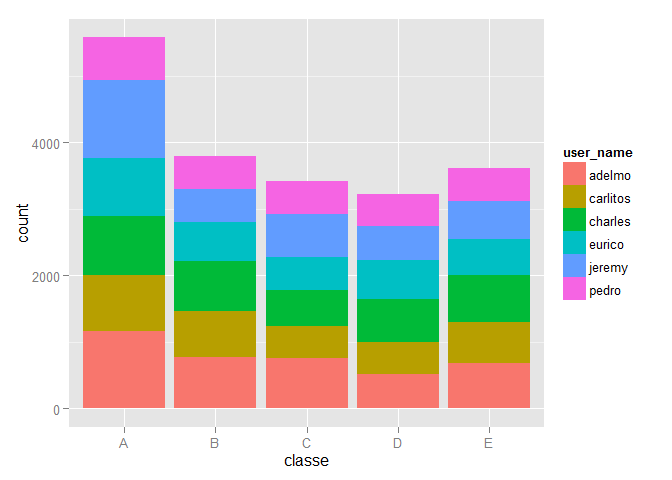
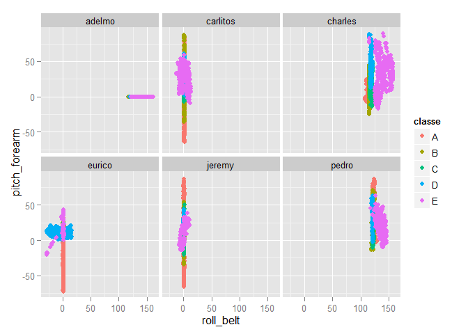
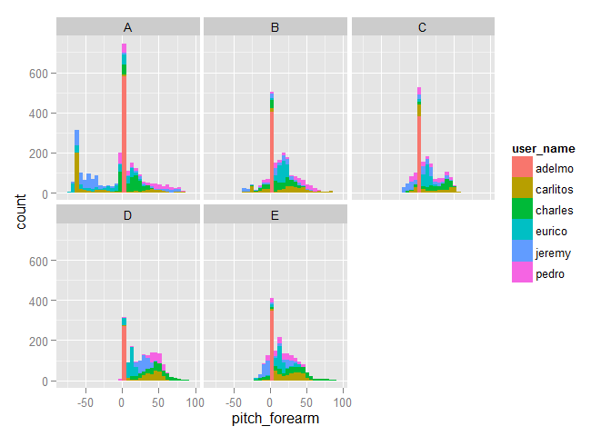
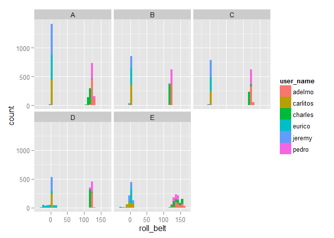
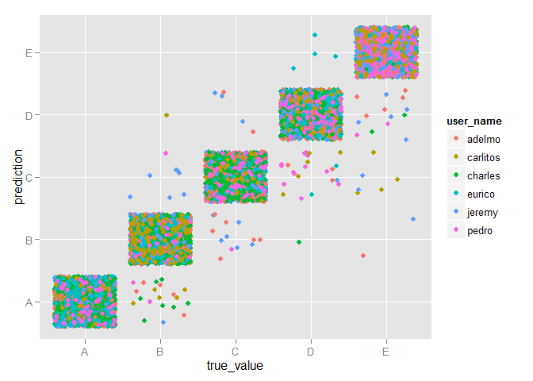

# Weight Lifting Exercise Quality Prediction
Steven Strand  
Friday, March 04, 2016  

## Overview

As part of a Coursera Class on Practical Machine Learning,
an analysis of dumbbell exercise data was performed using the caret package in R.
The analysis predicts the manner in which the participants did the exercise, based on a training set in which the quality was ranked with a classe variable ranging from A (good) to E (poor).
This report describes how the model was built, and how cross validation was used to improve the model. An estimate is made of the out of sample error based on cross validation results and predictions for a validation data set. The report describes the logic behind choosing the final model. The model was used to predict the classe variable for 20 test cases as part of a project quiz.

## Methodology
The following steps were used to build the final model:

### Pre-Processing

1) The data set was cleaned to remove blank and NA variables
1) A small number of outliers were removed. An outlier here is defined as points more than 10 times the IQR outside the IQR.
1) Some predictor variables such as time were excluded from the set of predictors

### Preliminary Analysis

1) Data were analyzed using exploratory plots and summaries

### Modeling with Various Learning Methods

1) The training data set was divided into a set for model training and another set for validation
1) Numerous learning methods in the caret package in R were used on the training set to build models
1) The models were evaluated on the validation set

### Optimization

1) The more promising learning methods were optimized by choosing additional pre-processing techniques 
1) Cross-validation was performed on some of the models
1) Various training set sizes were used to find a balance between computation time and accuracy
1) Parallel processing was used to speed up computations significantly, but this feature was not used in the final case due to memory allocation issues.

### Application to the Test Data

1) The model was used to predict the classe variable for the test data
1) The test predictions were submitted on the course web site

## Result Summary

1) The best model used was a random forest model using 50% of the training data (9804 samples).
1) The accuracy on the training set using the optimal model was 98.4 %
1) The accuracy on the validation set was 99.0 %
1) The accuracy on the test set of 20 was 100%. All classe variables were predicted correctly using the random forest model.
1) The random forest model did not require any special pre-processing to achieve high accuracy,although centering and scaling was used in the final model.
1) The time of computation for the random forest model was the longest of all those tested, at 3148 sec.
1) The K-Nearest Neighbor model was also a very good choice, with high accuracy (94.5%) and a much shorter computation time (333 sec) on the validation data set.

## Obtaining & Cleaning Data

### Reading in Data

```r
# Speed up computations with parallel processing
#library(doParallel)
#registerDoParallel(cores=3)

# Load the librararies
library(caret)
library(ggplot2)

# Read in the data set
pml.train <- read.csv("pml-training.csv",stringsAsFactors = FALSE)
pml.test <- read.csv("pml-testing.csv",stringsAsFactors = FALSE)
```

### Pre-Processing the Data


```r
# Find indices of columns with mostly NA values
n_na <- apply(pml.train,2,function(x) sum(is.na(x)))
fr_na <- n_na/nrow(pml.train)

idx_skip_na <- which(fr_na>0.97)
cat("There were ",length(idx_skip_na)," columns with more than 97% NA values\n")
```

```
## There were  67  columns with more than 97% NA values
```

```r
# Find indices of columns with mostly blank values
n_blank <- apply(pml.train,2,function(x) sum(x==""))
fr_blank <- n_blank/nrow(pml.train)
idx_skip_blank <- which(fr_blank>0.95)
cat("There were ",length(idx_skip_blank)," columns with more than 95% blank values\n")
```

```
## There were  33  columns with more than 95% blank values
```

```r
idx_skip <- c(idx_skip_na,idx_skip_blank)

training <- pml.train[,-idx_skip]
testing <- pml.test[,-idx_skip]

# Make certain variables into factors
training$classe <- as.factor(training$classe)
training$user_name <- as.factor(training$user_name)
testing$user_name <- as.factor(testing$user_name)

# Remove some variables from data frame that will not be used in the modeling
extra_vars <- c("X","raw_timestamp_part_1","raw_timestamp_part_2","cvtd_timestamp","new_window","num_window")
training_sm <- training[,!names(training) %in% extra_vars]
testing_sm <- testing[,!names(testing) %in% extra_vars]

# Find any obviously bad data. 
# Here search for values more than a specified multiplier of the IQR in the training data

flag_outliers <- function(x,cutoff) {
    qnt <- quantile(x, probs=c(.25, .75))
    hdelta   <- cutoff* IQR(x)
    ilo <-which(x < (qnt[1]-hdelta))
    ihi <- which(x > (qnt[2]+hdelta))
    return(c(ilo,ihi))

}
check_outliers <- function(df1,cutoff) {
    idx_remove <- c()
    for( vname in colnames(df1)) {
        if(vname=="classe") next
        if(vname=="user_name") next
        iout <- flag_outliers(df1[[vname]],cutoff=cutoff)
        if(length(iout)>0) {
            cat("Outliers in Var:",vname,"\n")
            print(iout)
            idx_remove <- c(idx_remove,iout)
        }
    }
    return(unique(idx_remove))
}

# Look for bad data
idx_remove <- check_outliers(training_sm,cutoff=10)
```

```
## Outliers in Var: gyros_belt_x 
##  [1] 16016 16017 16018 16019 16020 17962 17963 17964 17965 17966
## Outliers in Var: gyros_dumbbell_x 
## [1] 5373
## Outliers in Var: gyros_dumbbell_y 
## [1]  152 5373
## Outliers in Var: gyros_dumbbell_z 
## [1] 5373
## Outliers in Var: magnet_dumbbell_y 
## [1] 9274
## Outliers in Var: gyros_forearm_x 
## [1] 5373
## Outliers in Var: gyros_forearm_y 
## [1] 5373
## Outliers in Var: gyros_forearm_z 
## [1]  941  947  952 5373
```

```r
cat("Rows in training data with outliers:", idx_remove,"\n")
```

```
## Rows in training data with outliers: 16016 16017 16018 16019 16020 17962 17963 17964 17965 17966 5373 152 9274 941 947 952
```

```r
# There are a small number of outliers in a large data set. It seems expedient to remove them.
training_sm2 <- training_sm[-idx_remove,]
```

### Split the Data

```r
# Create a subset for training and another for validation
set.seed(10101)

pfrac=0.5

inTrain <- createDataPartition(y=training_sm2$classe,p=pfrac,list=FALSE)
df_training <- training_sm2[inTrain,]
df_validation <- training_sm2[-inTrain,]
```

## Exploratory Data Analysis
Plots and summaries of the training data were used to identify issues such as data outliers, missing data and highly correlated variables. 
Some response variables were observed to have dramatically different mean values for different user_name values, especially for some variables associated with the belt measurements. 


The following plot shows that the data is distributed fairly evenly over the classe categories and user_names, with the exception of classe A having significantly more data:


```r
qplot(classe,fill=user_name,data=training_sm)
```

 

The following plot shows data from the training subset for the two most important variables found in the random forest model.
The plots give some indication of how a learning model might differentiate and classify the classe variable.


```r
ggplot() + facet_wrap(~user_name)+
    geom_point(mapping=aes(x=roll_belt,y=pitch_forearm,color=classe),
                                              data=df_training)
```

 

It was instructive to examine histograms of all the data, separated by user_name and classe category. These plots were performed using a "for" loop in R. It was noted in this study that some of the variables were relatively mono-modal, while others were bimodal with modes separated by user_name values.

In the mono-modal case, the following plot shows histograms of the pitch_forearm variable data for various classes and user_names. The data for this variable are centered near each other for all users.


```r
ggplot() + facet_wrap(~classe)+geom_histogram(data=df_training, mapping=aes(x=pitch_forearm, fill=user_name))
```

 

The following histograms show that the roll_belt data is bimodal and unlike the data for pitch_forearm. In this case, the responses for some users are distinct from others. This bimodal feature should make training a learning model more difficult since the responses and variation by classe are different based on the user_name variable. This data feature suggests that creating individual models for each user might yield better predictions.


```r
ggplot() + facet_wrap(~classe)+geom_histogram(data=df_training, mapping=aes(x=roll_belt, fill=user_name))
```

 

## Fitting Models to the Data
Several models were fit to the data. 
Models were chosen by first evaluating their performance on smaller data sets.
Models with relatively high accuracy and reasonable computation times were used for further analysis with larger data sets.
The relative accuracy for various models was tested using the confusionMatrix function for model predictions on the validation data set.


```r
# Keep some statistics to compare models
eltime <- c()
acc <- list()
```

### Conditional Inference Tree Model (ctree)

```r
nrow(df_training)
```

```
## [1] 9804
```

```r
set.seed(10101)
pt1 <- proc.time()
model_ctree <- train(classe ~ ., data=df_training,method="ctree",preProcess=c("center","scale"))
eltime["ctree"] = (proc.time()-pt1)[3]

pred_ctree <- predict(model_ctree, df_validation)
cm_ctree <- confusionMatrix(pred_ctree,df_validation$classe)
acc[["ctree"]] <- cm_ctree$overall
```

### K-Nearest Neighbor Model (knn)

```r
nrow(df_training)
```

```
## [1] 9804
```

```r
set.seed(10101)
pt1 <- proc.time()
model_knn <- train(classe~., data=df_training,method="knn",preProcess=c("center","scale"))
eltime["knn"] = (proc.time()-pt1)[3]

pred_knn <- predict(model_knn,df_validation)
cm_knn <- confusionMatrix(pred_knn,df_validation$classe)
acc[["knn"]] <- cm_knn$overall
```

### Random Forest (rf)

```r
nrow(df_training)
```

```
## [1] 9804
```

```r
set.seed(10101)
pt1 <- proc.time()
model_rf <- train(classe~., data=df_training,method="rf",preProcess=c("center","scale"))
eltime["rf"] = (proc.time()-pt1)[3]

pred_rf <- predict(model_rf,df_validation)
cm_rf <- confusionMatrix(pred_rf,df_validation$classe)
acc[["rf"]] <- cm_rf$overall
```

## Compare Model Results for the Validation Data

The following tables show the accuracy and elapsed time results for the three modeling methods tested. 
The accuracy on the top row was used as the main criteria for model selection.


```r
df_acc <- data.frame(acc)
df_eltime <- data.frame(elapsed_time=eltime)

df_acc
```

```
##                       ctree          knn        rf
## Accuracy       8.709447e-01 9.452153e-01 0.9901041
## Kappa          8.365171e-01 9.306506e-01 0.9874805
## AccuracyLower  8.641463e-01 9.405254e-01 0.9879410
## AccuracyUpper  8.775218e-01 9.496383e-01 0.9919679
## AccuracyNull   2.843297e-01 2.843297e-01 0.2843297
## AccuracyPValue 0.000000e+00 0.000000e+00 0.0000000
## McnemarPValue  5.038800e-10 7.118357e-23       NaN
```

```r
df_eltime
```

```
##       elapsed_time
## ctree       811.38
## knn         337.07
## rf         3150.99
```

### Discussion about More Complex Models
Several other approaches were studied for modeling in order to reduce calculation time and still achieve high accuracy.

1) Individual models were built for each user for the LDA, RF and KNN methods. In the exploratory data analysis it was observed that distribution of some predictors vary significantly for each user, suggesting that individual models might be more accurate.
Using individual models, the accuracy on the validation set improved significantly for the LDA method, but not the others.
The time required for calculation decreased slightly using this approach.
Since the model is more complex and the resulting accuracy for the LDA case was below that of the KNN and RF methods, it is not discussed further here for brevity.

1) Stacked models were used in which three models with low computing time requirements were fit to the data, and their predictions were used as new predictors. This approach was tried to reduce overall calculation time.
In this test, the three methods were RPART, LDA, and CTREE. The final model that used the first predictions was a random forest. The final model improved the accuracy of the best model, CTREE. The amount of improvement was small, however, so this method is not recommended.


## Discussion of Fit Results for Random Forest Model

### Final Model Selection
The final model was chosen based on accuracy achieved on the validation data set. 
The time required to obtain a prediction was an important factor as well. 
In this case, the accuracy for the random forest model was found to increase with the size of the training sample.
High accuracy could be obtained using random forest in a reasonable amount of time, so it is recommended as the modeling method.

### Cross-Validation
The random forest model does cross validation as part of the algorithm, so additional cross-validation pre-processing is not necessary.

### Estimate of Out of Sample Error
The random forest model reports an estimate of the out of sample error for the fitted model on the training data.
The actual error observed on the validation data was extremely close to the estimate based on the training data.

### Accuracy Limitations due to Rmarkdown Issues
Many calculations were done in R prior to writing this summary report using Rmarkdown. 
The Rmarkdown method caused problems with memory allocation not present in the earlier work.
It seems likely that performing long calculations, saving results and then loading the results for analysis and discussion is a more practical approach.
In this report, calculations were done in each R chunk individually and cached. Due to this limitation, a smaller training data set was used than done earlier, resulting in a lower accuracy for the random forest model

### Model Results
The random forest model results are shown below. The most important variables in the model are listed.


```r
model_rf
```

```
## Random Forest 
## 
## 9804 samples
##   53 predictor
##    5 classes: 'A', 'B', 'C', 'D', 'E' 
## 
## Pre-processing: centered, scaled 
## Resampling: Bootstrapped (25 reps) 
## Summary of sample sizes: 9804, 9804, 9804, 9804, 9804, 9804, ... 
## Resampling results across tuning parameters:
## 
##   mtry  Accuracy   Kappa      Accuracy SD  Kappa SD   
##    2    0.9811683  0.9761693  0.002313762  0.002922550
##   29    0.9839098  0.9796388  0.002405793  0.003046295
##   57    0.9742297  0.9673899  0.005033622  0.006372246
## 
## Accuracy was used to select the optimal model using  the largest value.
## The final value used for the model was mtry = 29.
```

```r
varImp(model_rf)
```

```
## rf variable importance
## 
##   only 20 most important variables shown (out of 57)
## 
##                      Overall
## roll_belt             100.00
## pitch_forearm          61.46
## yaw_belt               54.54
## magnet_dumbbell_y      45.29
## pitch_belt             44.46
## magnet_dumbbell_z      44.13
## roll_forearm           42.47
## accel_dumbbell_y       24.83
## accel_forearm_x        18.28
## roll_dumbbell          17.20
## magnet_belt_z          17.08
## magnet_dumbbell_x      16.99
## accel_belt_z           16.08
## accel_dumbbell_z       15.96
## total_accel_dumbbell   15.58
## magnet_forearm_z       15.37
## magnet_belt_y          14.08
## gyros_belt_z           12.75
## magnet_belt_x          12.20
## yaw_arm                10.65
```

The following plot shows the agreement of the reported classe value with the predictions for the validation data set. Predictions for classe A are totally accurate. There is no obvious pattern to the other errors as a function of user_name.


```r
df_compare <- data.frame(true_value=df_validation$classe,prediction=pred_rf,user_name=df_validation$user_name)
ggplot() + geom_jitter(mapping=aes(x=true_value,y=prediction,color=user_name),data=df_compare)
```

 


## Predict Test Classe Behavior

```r
pred_test <- predict(model_rf,testing_sm)
pred_test
```

```
##  [1] B A B A A E D B A A B C B A E E A B B B
## Levels: A B C D E
```

## References
Data was originally made available from 
[http://groupware.les.inf.puc-rio.br/har](http://groupware.les.inf.puc-rio.br/har).

